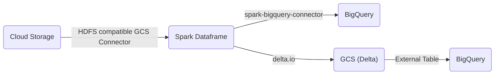

# TL;DR

A simple Spark Structured Streaming application that reads Json files from Google Cloud Storage and streams resulting documents into BigQuery. Another stream aggregates the incoming data by event time and sinks to a Delta table in GCS.



The results streamed to the Delta table in GCS are aggregated by [Windowed Event Time](https://spark.apache.org/docs/latest/structured-streaming-programming-guide.html#window-operations-on-event-time). For testing purposes, I viewed these reults in BigQuery using an external table.

### Example Input Data

```json
{ "name": "chas", "id": "2", "time": "2023-08-17 17:54:00.000" }
```

### Example Delta Table _(Aggregated Results)_

```json
[
  {
    "window": {
      "start": "2023-08-17 17:54:00.000000 UTC",
      "end": "2023-08-17 17:55:00.000000 UTC"
    },
    "count": "1"
  },
  {
    "window": {
      "start": "2023-08-17 17:53:00.000000 UTC",
      "end": "2023-08-17 17:54:00.000000 UTC"
    },
    "count": "1"
  },
  {
    "window": {
      "start": "2023-08-17 17:59:00.000000 UTC",
      "end": "2023-08-17 18:00:00.000000 UTC"
    },
    "count": "1"
  },
  {
    "window": {
      "start": "2023-08-17 17:58:00.000000 UTC",
      "end": "2023-08-17 17:59:00.000000 UTC"
    },
    "count": "1"
  }
]
```

### Show Cluster Time

```scala
// return cluster local time
val df = Seq((1)).toDF("seq")
val x = df.withColumn("current_timestamp",current_timestamp())
```

# Local Development

When developing locally using [Metals](https://scalameta.org/metals/) or IntelliJ, credentials must be available to authenticate with BigQuery. Set the `GOOGLE_APPLICATION_CREDENTIALS` environment variable to the service account key json file path. More info [here](https://cloud.google.com/docs/authentication/application-default-credentials).

> //TODO switch credential configuration file to workload identity federation.

_Ex:_

```bash
export GOOGLE_APPLICATION_CREDENTIALS=/Users/chasf/df-credentials.json
```

Next the master URL for the cluster must be defined as _local_. Make sure the `.config()` parameters are commented out when deploying to production.

_Ex:_

```scala
 val spark = SparkSession.builder
      .appName("Bq Demo")
      .config("spark.master", "local[*]") // comment out when deploying
      .getOrCreate()
```

The `local[*]` configuration sets the worker threads equal to the logical cores on your machine. More information [here](https://spark.apache.org/docs/latest/submitting-applications.html#master-urls).

There are two options for writing data BigQuery using the Spark connector, Direct Mode and Indirect Mode.

Indirect relies on the [GCS Spark Connector](https://github.com/GoogleCloudDataproc/hadoop-connectors/tree/master/gcs) which is NOT included with the connector. The Maven package for this connector is available here:

> // https://mvnrepository.com/artifact/com.google.cloud.bigdataoss/gcs-connector
>
> libraryDependencies += "com.google.cloud.bigdataoss" % "gcs-connector" % "hadoop3-2.2.10"

Several Spark settings are also required when using the GCS connector locally. Comment these out before deploying to Dataproc _(see below)_. More information on these settings can be found [here](https://github.com/GoogleCloudDataproc/hadoop-connectors/tree/master/gcs).

```scala
  val spark = SparkSession.builder
     .appName("Bq Demo")
     // .config("spark.master", "local[*]")
     // .config(
     //   "spark.hadoop.fs.AbstractFileSystem.gs.impl",
     //   "com.google.cloud.hadoop.fs.gcs.GoogleHadoopFS"
     // )
     // .config("spark.hadoop.fs.gs.project.id", "cf-data-analytics")
     // .config("spark.hadoop.google.cloud.auth.service.account.enable", "true")
     // .config(
     //   "spark.hadoop.google.cloud.auth.service.account.json.keyfile",
     //   "/Users/chasf/Desktop/cf-data-analytics-1ff73e9e3f7a.json"
     // )
     .getOrCreate()
```

# Reference

This application was built using several articles as reference. These sources are listed below.

## GCS Actions

https://github.com/google-github-actions/upload-cloud-storage

This library was used in the deployment script to move the fat Jar into Google Cloud Storage. The Jar can be deployed to Dataproc using `gcloud`.

_For example_:

```shell
gcloud dataproc jobs submit spark
```

Considerations:

1. Turn off gzip content encoding. Spark isn't configured to read compressed Jar files.

```yaml
gzip: false
```

2. Specify a Glob Pattern _(wildcard)_ to reference the latest version number declared in `build.sbt`.

```yaml
glob: "*.jar"
```

## Setup Java Runner for SBT Deployment

https://github.com/actions/setup-java

This repo documents yaml instructions for setting up a Java runner. The sbt Scala build takes place on the Java runner.

## Configure SBT Build

These two articles document `build.sbt` and `plugins.sbt` configurations.

GCP instructions for setting up SBT:

https://cloud.google.com/dataproc/docs/guides/manage-spark-dependencies

## Build Authentication

Article where SBT was used with Github Actions to deploy uber Jars to S3:

https://medium.com/alterway/building-a-ci-cd-pipeline-for-a-spark-project-using-github-actions-sbt-and-aws-s3-part-1-c7d43658832d

This project includes a yaml file for deployment to Google Cloud using Github Actions maintained here: https://github.com/google-github-actions/deploy-cloud-functions. The Github Action Workflow requires several _"Action Secrets"_ used to set environment variables during deployment. Set the following secrets in the repository before deployment.

| Action Secret | Value                                                          |
| ------------- | -------------------------------------------------------------- |
| GCP_SA_KEY    | Service Account Key used to authenticate GitHub to GCP Project |
